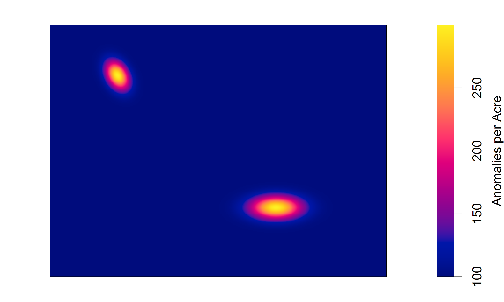
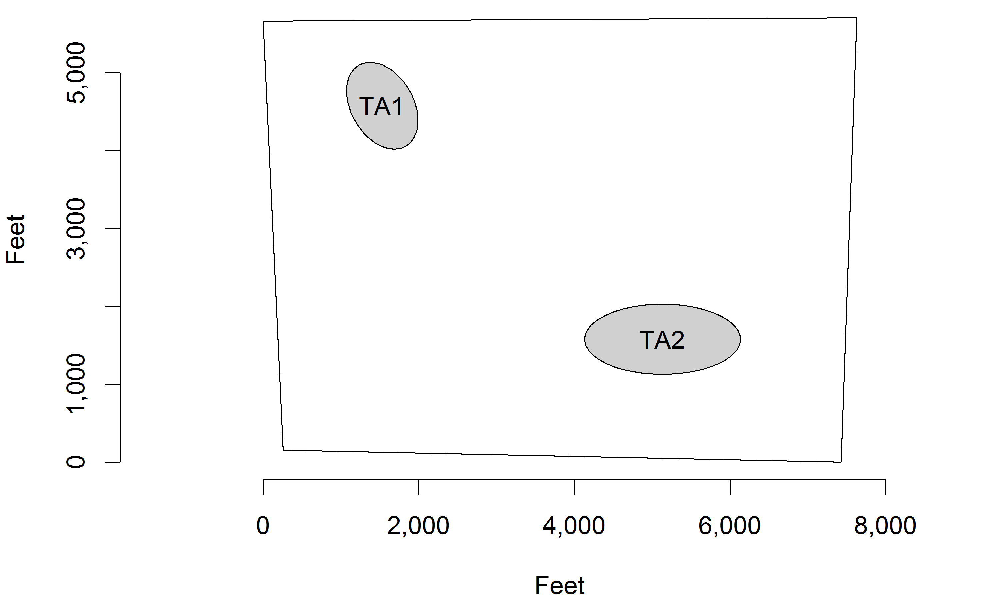
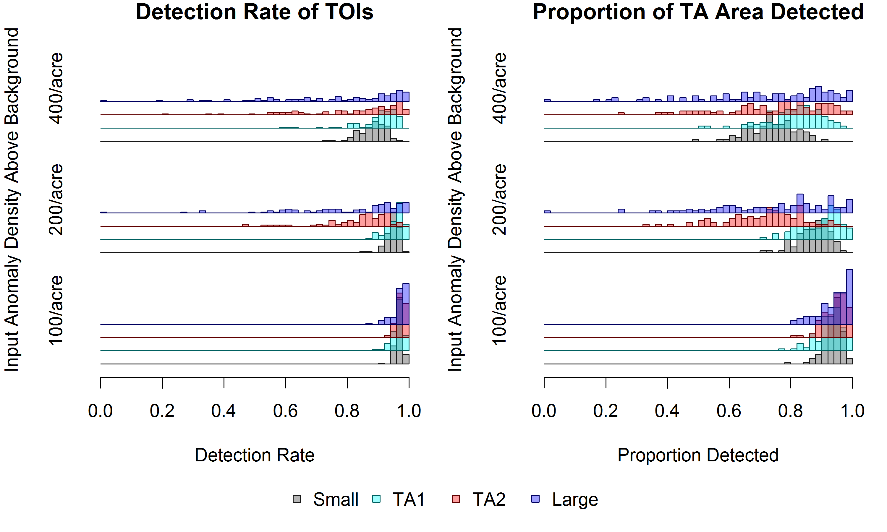
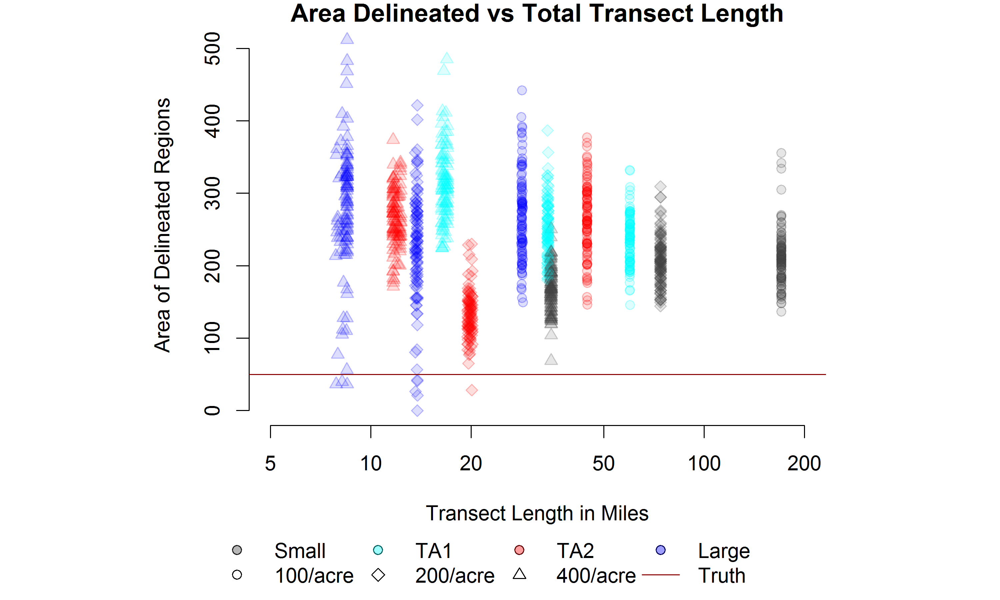
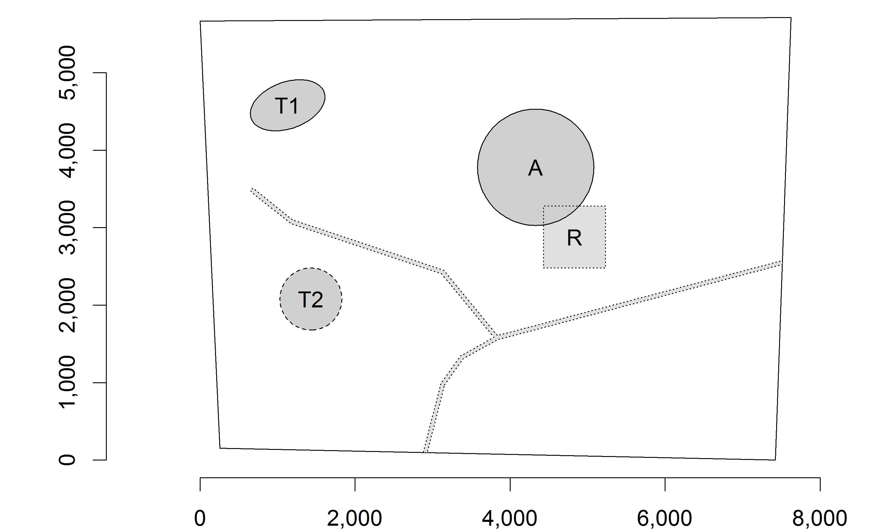

# Introduction and Background

## Introduction

- Military activities leave debris behind
    - Including explosive munitions
- Hazardous sites should be remediated
- Statistics can reduce costs
- Visual Sample Plan [@vsp]
    - Software popular with DoD contractors
- My project:
    - Understand how sample plan inputs affect VSP mapping
    - Simulation study

## Unexploded Ordnance {data-transition="fade"}

## Unexploded Ordnance {data-transition="none"}

## Unexploded Ordnance {data-transition="none"}

## Targets of Interest vs Anomalies

- Target of interest (TOI) -- munitions-related item which could be
unexploded ordnance (UXO)
- Anomaly -- any item detected by a metal detector

## Spatial Anomaly Density

### Background + TOI

# Visual Sample Plan Overview

## Target Area Identification Features

- Systematic transect sampling plans
- Analyze sample data
    - Moving average anomaly density
    - Semivariogram models
    - Ordinary Kriging
    - Delineate high-density regions

## Parallel Transect Sampling Plan

## Anomaly Density Map

# What inputs affect the delineation the most?

## Prior Info Experiment

- Simulation Study
    - Three sites
    - Varying complexity: _easy_, _medium_, _hard_
    - Sampling plans created with VSP
    - Kriging and delineation similar to VSP

&nbsp;

- Factors:
    - VSP input TA size
        - Levels: Too Small, TA1, TA2, Too Large
    - VSP input TA anomaly density
        - 100/acre, 200/acre, 400/acre

## Easy Site

100 realizations analyzed with each spacing

<table>
<thead>
<tr class="header">
<th style="text-align: center;" rowspan=2>Input TA Size</th>
<th style="text-align: center;" colspan=3>Input TA Anomaly Density</th>
</tr>
<tr class="header">
<th style="text-align: center;">100/acre</th>
<th style="text-align: center;">200/acre</th>
<th style="text-align: center;">400/acre</th>
</tr>
</thead>
<tbody>
<tr>
<td style="text-align: center; font-weight:bold;">
Too Small (849 ft by 566 ft, 8.66 acres)</td>
<td style="text-align: center;">40 ft</td>
<td style="text-align: center;">100 ft</td>
<td style="text-align: center;">220 ft</td>
</tr>
<tr>
<td style="text-align: center; font-weight:bold;">
TA1 (1,200 ft by 800 ft, 17.3 acres)</td>
<td style="text-align: center;">125 ft</td>
<td style="text-align: center;">225 ft</td>
<td style="text-align: center;">465 ft</td>
</tr>
<tr>
<td style="text-align: center; font-weight:bold;">
TA2 (2,000 ft by 900 ft, 32.4 acres)</td>
<td style="text-align: center;">170 ft</td>
<td style="text-align: center;">390 ft</td>
<td style="text-align: center;">655 ft</td>
</tr>
<tr>
<td style="text-align: center; font-weight:bold;">Too Large
(2,828 ft by 1,273 ft, 64.9 acres)</td>
<td style="text-align: center;">270 ft</td>
<td style="text-align: center;">565 ft</td>
<td style="text-align: center;">935 ft</td>
</tr>
</tbody>
</table>

## Easy Site

# Results

## Results

## Results

## Results

# Conclusions

## Conclusions

- Most TOI items detected
- Too much area delineated
- Need accurate info about TA size
    - Density info relatively unimportant
- More data reduces variability but not bias

## Conclusions

- My recommendations:
    - Focus on TA size
    - Use smallest TA for sampling plan
    - Do not sample more than necessary

# Acknowledgements

## Acknowledgements

- Megan Higgs
- Katie Catlett, Stephanie Fitchett
- Lenovo
- My Mom
- YOU!

# Appendix

## Medium Site

## Hard Site

# References

## References
