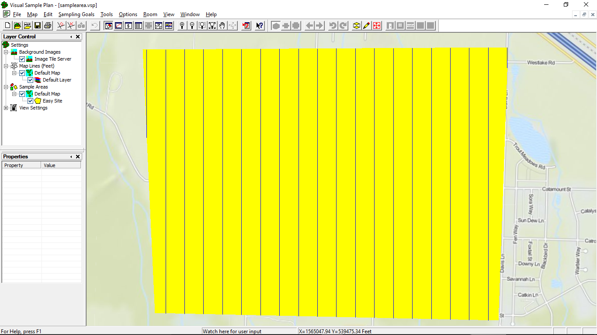

```{r setup, cache=FALSE, echo=FALSE, message=FALSE, warning=FALSE}
knitr::opts_chunk$set(cache=TRUE, echo=FALSE, warning=FALSE, message=FALSE,
  #out.width='900px', out.height='450px',
  fig.width=10, fig.height=6, dpi=150, fig.align='center',
  dev.args=list(family='serif', pointsize=21, bg = '#f7f2d300'))

require(png)
require(spatstat)

# True TAs and site
sitewindow <- owin(poly = cbind(
  x = c(1564294, 1564495, 1556870, 1557126)-1556870,
  y = c(535421, 541130, 541085, 535576)-535421))
TA1 <- ellipse(800/2, 1200/2, c(1558400-1556870, 540000-535421), pi/6)
TA2 <- ellipse(2000/2, 900/2, c(1562000-1556870, 537000-535421), 0)
TAs.easy <- union.owin(TA1, TA2)
TAs.medh <- union.owin(ellipse(1000/2, 600/2,
                               c(1558000-1556870, 540000-535421), pi/9),
                       ellipse(1500/2, 1500/2,
                               c(1561200-1556870, 539200-535421), 0))
TA2.medh <- ellipse(800/2, 800/2, c(1558300-1556870, 537500-535421), 0)
road <- intersect.owin(
  dilation(psp(x0 = c(1559750, 1560000, 1560250, 1560700,
                      1560700, 1560000, 1558050)-1556870,
               y0 = c(535421, 536400, 536750, 537000,
                      537000, 537850, 538500)-535421,
               x1 = c(1560000, 1560250, 1560700, 1564495,
                      1560000, 1558050, 1557550)-1556870,
               y1 = c(536400, 536750, 537000, 538000,
                      537850, 538500, 538900)-535421,
               window = boundingbox(sitewindow)),
           25), sitewindow)
ranch <- owin(c(1561300, 1562100)-1556870, c(537900, 538700)-535421)

source('../rfns/myhists.r')
source('../rfns/data_functions.r')
source('../rfns/spatial_functions.r')

load('../datasets/easy/results/easy_exp2results.RData')
load('../datasets/easy/results/easy_exp2ndist.RData')
load('../datasets/easy/results/easy_exp2areas.RData')
```


# Introduction and Background


## Introduction

- Military activities leave debris behind
    - Including explosive munitions
- Hazardous sites should be remediated
<!--    - Motlow, TN [@motlowdemo]
    - Helena Valley, MT [@nephelena] -->
- Statistics can reduce costs
- Visual Sample Plan [@vsp]
    - Software popular with DoD contractors
- My project:
    - Understand how sample plan inputs affect VSP mapping
    - Simulation study


<!-- # Background: Unexploded Ordnance -->


## Unexploded Ordnance {data-transition="fade"}


## Unexploded Ordnance {data-transition="none"}


## Unexploded Ordnance {data-transition="none"}


## Targets of Interest vs Anomalies

- Target of interest (TOI) -- munitions-related item which could be
unexploded ordnance (UXO)
- Anomaly -- any item detected by a metal detector


<!-- ## Background: Detecing UXO

- UXO items are a subset of TOI items
- It is assumed most TOI items are located in TAs that can be mapped
- Non-TOI anomalies are considered background noise
    - Assumed to be homogeneously distributed with low spatial density
- High density regions are possible TAs
- Sites surveyed with magnetometers or DGM equipment
    - Anomaly locations recorded and spatial density analyzed -->


## Spatial Anomaly Density

### Background + TOI

```{r heatmap}
x <- seq(1556870, 1564495, by = 20)
y <- seq(535421, 541130, by = 20)
intense.mat <- matrix(100, nrow = length(x), length(y))
for(i in seq_along(x)){
  for(j in seq_along(y)){
    intense.mat[i, j] <- 100 + gauss.elliptic(x[i]+10, y[j]+10,
        mu.x = 1558400, mu.y = 540000,
        s.a = 800/(2*qnorm(0.995)), s.b = 1200/(2*qnorm(0.995)),
        r = pi/6, maxrate = 200
      ) + gauss.elliptic(x[i]+10, y[j]+10,
        mu.x = 1562000, mu.y = 537000,
        s.a = 2000/(2*qnorm(0.995)), s.b = 900/(2*qnorm(0.995)),
        r = 0, maxrate = 200
      )
  }
}
intense.im <- im(t(intense.mat), x+10, y+10, unitname = c('foot', 'feet'))

par(mar = c(1, 1, 1, 1))
plot(intense.im, main = '')
mtext('Anomalies per Acre', 4)
```


<!-- # Clean-Up (Remediation) -->


<!-- ## Clean-Up (Remediation)

### Before the project:
- Define project objectives/success criteria
    - What is an acceptable amount of TOI to remain at the site?
    - How much uncertainty is permittable?<br />
&nbsp;

### Steps of the clean-up project:
1. Collect information to identify regions needing remediation
    - Historical records
    - Sampling, if necessary
2. Clear identified regions of all possible targets
3. Verification sampling
    - Confirm that the cleanup was successful
    - "We are Y% confident that at least X% of the site area is free of UXO"
-->

<!-- # Visual Sample Plan -->


<!-- ## Visual Sample Plan: Overview

- Transect and grid sampling plans for spatial data
- Hypothesis tests and confidence intervals for means and proportions
- Kriging to map predicted repsonses across a site
- A suite of UXO features
    - I focus on a few features for mapping TAs -->

# Visual Sample Plan Overview


## Target Area Identification Features

- Systematic transect sampling plans
<!--    - Calculates probability of detecting TA of user-specified size
    - TA is "detected" if any transect crosses it -->
- Analyze sample data
    - Moving average anomaly density
    - Semivariogram models
    - Ordinary Kriging
    - Delineate high-density regions


<!-- ## Detection Probability Curve

 -->


## Parallel Transect Sampling Plan




<!-- ## Moving Average Search Window

```{r windows, eval=FALSE, fig.height=5}
ldens <- read.geoeas('../include/vsp.dat')
ldens$X <- ldens$X-1556870
ldens$Y <- ldens$Y-535421
layout(rbind(c(1, 2)), width = c(4, 3))
par(mar = c(2, 2, 0, 0))
plot(dilation(sitewindow, 200), show.all = FALSE, type = 'n')
plot(sitewindow, add = TRUE)
for(i in 1:nrow(ldens)){
  plot(disc(400, c(ldens$X[i], ldens$Y[i])), border = '#00000040', add = TRUE)
}
points(ldens$X, ldens$Y, pch = '.', col = 'blue', cex = 2)
axis(1, at = axTicks(1), labels = prettyNum(axTicks(1), big.mark = ','))
axis(2, at = axTicks(2), labels = prettyNum(axTicks(2), big.mark = ','))

thexsects <- union.owin(owin(c(-0.1, 0.1), c(0, 1)),
                        owin(c(0.4, 0.6), c(0, 0.6)),
                        owin(c(0.4, 1.2), c(0.6, 0.8)))
thewindow <- disc(0.45, c(0.5, 0.5))
centers <- cbind('y' = c(seq(0, 1, 0.15), seq(0.05, 0.35, 0.15), rep(0.5, 3)),
                 'x' = c(rep(0.2, 7), rep(0.5, 2), seq(0.5, 1, 0.15)))
set.seed(3465)
anomalies <- rpoispp(50, win = thexsects)
par(mar = c(0, 0, 0, 0))
plot(owin(c(-0.2, 1.2), c(-0.2, 1.2)), show.all = FALSE, type = 'n')
plot(intersect.owin(thewindow, thexsects),
     col = 'lightgrey', border = NA, add = TRUE)
segments(x0 = c(-0.1, 0.1, 0.4, 0.4, 0.6, 0.6),
         y0 = c( 0,   0,   0,   0.8, 0,   0.6),
         x1 = c(-0.1, 0.1, 0.4, 1.2, 0.6, 1.2),
         y1 = c( 1,   1,   0.8, 0.8, 0.6, 0.6), col = 'darkgrey')
plot(anomalies[complement.owin(thewindow, owin(c(-0.2, 1.2), c(-0.1, 1.1)))],
     add = TRUE, pch = 19, col = 'black')
plot(anomalies[thewindow], add = TRUE, pch = 19, col = 'red')
plot(thewindow, add = TRUE)
```
-->


<!-- ## Visual Sample Plan: Example Semivariogram

 -->


## Anomaly Density Map


<!-- # Simulation Study -->


# What inputs affect the delineation the most?

## Prior Info Experiment

- Simulation Study
    - Three sites
    - Varying complexity: _easy_, _medium_, _hard_
    - Sampling plans created with VSP
    - Kriging and delineation similar to VSP

&nbsp;

- Factors:
    - VSP input TA size
        - Levels: Too Small, TA1, TA2, Too Large
    - VSP input TA anomaly density
        - 100/acre, 200/acre, 400/acre

<!-- All other inputs are held constant -->


<!-- ## Easy Site

- 952.4 acres
- Two elliptical TAs
- Realizations of spatial Poisson processes
    - Homogeneous 100 anomalies/acre background
    - 200 anomalies/acre above background at TA centers
        - Gaussian intensity function -->


## Easy Site

100 realizations analyzed with each spacing

<table>
<thead>
<tr class="header">
<th style="text-align: center;" rowspan=2>Input TA Size</th>
<th style="text-align: center;" colspan=3>Input TA Anomaly Density</th>
</tr>
<tr class="header">
<th style="text-align: center;">100/acre</th>
<th style="text-align: center;">200/acre</th>
<th style="text-align: center;">400/acre</th>
</tr>
</thead>
<tbody>
<tr>
<td style="text-align: center; font-weight:bold;">
Too Small (849 ft by 566 ft, 8.66 acres)</td>
<td style="text-align: center;">40 ft</td>
<td style="text-align: center;">100 ft</td>
<td style="text-align: center;">220 ft</td>
</tr>
<tr>
<td style="text-align: center; font-weight:bold;">
TA1 (1,200 ft by 800 ft, 17.3 acres)</td>
<td style="text-align: center;">125 ft</td>
<td style="text-align: center;">225 ft</td>
<td style="text-align: center;">465 ft</td>
</tr>
<tr>
<td style="text-align: center; font-weight:bold;">
TA2 (2,000 ft by 900 ft, 32.4 acres)</td>
<td style="text-align: center;">170 ft</td>
<td style="text-align: center;">390 ft</td>
<td style="text-align: center;">655 ft</td>
</tr>
<tr>
<td style="text-align: center; font-weight:bold;">Too Large
(2,828 ft by 1,273 ft, 64.9 acres)</td>
<td style="text-align: center;">270 ft</td>
<td style="text-align: center;">565 ft</td>
<td style="text-align: center;">935 ft</td>
</tr>
</tbody>
</table>


## Easy Site

```{r easy}
par(mar = c(4, 4, 0, 0))
plot(sitewindow, show.all = FALSE)
plot(TAs.easy, col = '#D0D0D0', add = TRUE)
text(c(1558400, 1562000)-1556870, c(540000, 537000)-535421,
     labels = c('TA1', 'TA2'))
mtext('Feet', c(1, 2), 3)
axis(1, at = axTicks(1), labels = prettyNum(axTicks(1), big.mark = ','))
axis(2, at = axTicks(2), labels = prettyNum(axTicks(2), big.mark = ','))
```


<!-- # Analysis


## Analysis

- Rule to decide if a location belongs to a possible TA:
    - VSP:
$$\widehat{\mathrm{Density}} > \text{User-specified threshold}$$
    - My analysis:
$$\widehat{\mathrm{Density}} > 100+1.645\times\sqrt{\text{Kriging variance}}$$

- How possible TA boundaries are defined:
    - VSP fits polygons around areas
    - I simply use the edges of grid cells
- Semivariogram fitting
    - I use weighted least squares [@cressie]
    - VSP's method is undocumented but behaves like WLS
- Delineated regions under 3 acres are ignored
- Other aspects are as similar to VSP as possible
- Software used:
    - R 3.2.3 [@baser]
    - spatstat 1.43-0 [@spat15]
    - GSLIB [@newgslib]


## Comparison With VSP Delineation

```{r delin, eval=FALSE}
par(mfrow = c(1, 2), mar = c(1, 2, 1, 0), bty = 'n')
vsp <- readPNG('../images/vspgeomap.png')
plot(NULL, xlim = c(-150, 841), ylim = c(0, 644), asp = 1, axes = FALSE)
rasterImage(vsp, 0, 0, 841, 644)

nreps <- 3000
nsamp <- 100

# Site parameters
width <- 6
bg.dens <- 100
fg.dens <- 200 # TRUE density for the simulation

# Sampling plan parameters (treatments)
ta.prior <- c('Small', 'TA1', 'TA2', 'Large')
fg.prior <- c(100, 200, 400)
spacings <- matrix(c(40, 125, 170, 270,
                    100, 225, 390, 565,
                    220, 465, 655, 935), ncol = 3)
window.sizes <- 0.9 * c(566, 800, 900, 1273)
ncells <- length(ta.prior) * length(fg.prior)
nobs <- nsamp * ncells

# Corners of site and number of discretized rows and columns
corners <- vertices(Frame(sitewindow))
xmin <- min(corners$x) + window.sizes / 12
ymin <- min(corners$y) + window.sizes / 12
nx <- ceiling(6 * (max(corners$x) - min(corners$x)) / window.sizes)
ny <- ceiling(6 * (max(corners$y) - min(corners$y)) / window.sizes)

itr <- 100
ta <- 3
fg <- 2
r <- (itr-1) * ncells

krige.out <- read.geoeas('../datasets/easy/exp2/rep2000_s0390_k.out')
krige.out[krige.out$Estimate == -999,] <- rep(NA, 2)
kest <- im(matrix(krige.out$Estimate, nrow = ny[ta], byrow = TRUE),
           seq(xmin[ta], length.out = nx[ta], by = window.sizes[ta]/6),
           seq(ymin[ta], length.out = ny[ta], by = window.sizes[ta]/6),
           unitname = c('foot', 'feet'))
kvar <- im(matrix(krige.out$EstimationVariance, nrow = ny[ta], byrow = TRUE),
           seq(xmin[ta], length.out = nx[ta], by = window.sizes[ta]/6),
           seq(ymin[ta], length.out = ny[ta], by = window.sizes[ta]/6),
           unitname = c('foot', 'feet'))

# Get the delineated regions, if there are any
highdens <- kest > bg.dens + qnorm(0.95) * sqrt(kvar)
if(sum(highdens) > 0){
  identified <- connected(highdens, background = FALSE)
  theareas <- sapply(levels(identified$v), function(x){
      return(area(Window(connected(identified==x,
                                 background = FALSE))[sitewindow]))
    })

  # Ignore regions less than 3 acres
  ignore <- which(theareas < 3*43560)
  theareas[ignore] <- NA
  theidentcount <- sum(!is.na(theareas))
  for(i in ignore){
    identified$v[identified$v==i] <- NA
  }
}
if(theidentcount > 0){
  idboundary <- as.polygonal(Window(identified))[sitewindow]
  Window(identified) <- idboundary
}

par(mar = c(1, 0, 1, 2))
Window(kest)<-sitewindow
plot(kest, main = '')
plot(idboundary, add = TRUE)
```
-->


<!-- ## Simulated Sites

- Easy
    - Two TAs
    - Homogeneous background
- Medium
    - Three TAs
    - Background: Homogeneous background, except along roads where density
is higher
- Hard
    - Three TAs
    - Background: Clustered, plus higher density along roads and in a
14.7 acre field -->


<!-- # Window Size Experiment -->

<!-- ## Window Size Experiment

- Goals:
    - Investigate effect of window diameter on results
    - Choose window sizes for the Prior Info Experiment
        - VSP user's guide suggestion: Choose diameter between the transect
spacing and the TA size [@userguide]
- 200 realizations of the _easy_ site -- took 14 hours to analyze
    - 6 foot wide transects and 225 feet between transects
- Five window sizes used
    - 150 ft, 228 ft, 516 ft, 798 ft, 1,500
- Responses considered:
    - Detection rate of TOI items
    - Proportion of true area delineated
    - Total area delineated
    - Number of disjoint regions delineated


## Window Size Experiment

```{r exp11, eval=FALSE}
## EXPERIMENT PARAMETERS
nreps <- 3000
nsamp <- 200
spacing <- 225
width <- 6
bg.dens <- 100
fg.dens <- 200

load(paste0('../datasets/easy/results/easy_winresults_sp', spacing,
            '_fg', fg.dens, '.RData'))
load(paste0('../datasets/easy/results/easy_winndist_sp', spacing,
            '_fg', fg.dens, '.RData'))
load(paste0('../datasets/easy/results/easy_winareas_sp', spacing,
            '_fg', fg.dens, '.RData'))
window.sizes <- unique(results$win)

cols <- c('#404040', '#00ffff', '#ff0000', '#0000ff',
          '#00ff00')#, '#ff00ff', '#ffff00')
dcols <- c('#181818', '#006060', '#600000', '#000060',
           '#006000')#, '#600060', '#606000')
colsa6 <- paste0(cols, '60')
colsa4 <- paste0(cols, '40')
colsa3 <- paste0(cols, '30')
colsa2 <- paste0(cols, '20')
dcolsa6 <- paste0(dcols, '60')

exp1legend <- function(){
  par(mar = c(0, 0, 0, 0))
  plot.new()
  legend('center', ncol = 3, bty = 'n',
         pch = c(rep(22, 5), 124), col = c(dcols, 'darkred'),
         pt.cex = c(rep(1, 5), 1.5), pt.bg = c(colsa6, 'darkred'),
         legend = c(paste(prettyNum(window.sizes, big.mark = ','),
                          'Foot Kriging Window'), 'Truth'))
  invisible()
}

exp1legendnotrue <- function(){
par(mar = c(0, 0, 0, 0))
plot.new()
legend('center', ncol = 3, bty = 'n',
       pch = rep(22, 5), col = dcols, pt.bg = colsa6,
       legend = paste(prettyNum(window.sizes, big.mark = ','),
                      'Foot Kriging Window'))
  invisible()
}

exp1legendcirc <- function(){
  par(mar = c(0, 0, 0, 0))
  plot.new()
  legend('center', ncol = 3, bty = 'n',
         pch = c(rep(21, 5), 124), col = c(dcols, 'darkred'),
         pt.cex = c(rep(1, 5), 1.5), pt.bg = c(colsa6, 'darkred'),
         legend = c(paste(prettyNum(window.sizes, big.mark = ','),
                          'Foot Kriging Window'), 'Truth'))
}

exp1legendcircnotrue <- function(){
  par(mar = c(0, 0, 0, 0))
  plot.new()
  legend('center', ncol = 3, bty = 'n',
         pch = rep(21, 5), col = dcols, pt.bg = colsa6,
         legend = paste(prettyNum(window.sizes, big.mark = ','),
                        'Foot Kriging Window'))
}
```

```{r exp12, eval=FALSE, dependson='exp11'}
layout(matrix(c(1, 3, 2, 3), nrow = 2), height = c(5, 1))
par(mar = c(4, 1, 1, 1))
histby(detect ~ win, data = results, quantile = FALSE, reversex1 = TRUE,
       breaks = seq(0, 1, 0.02), xlim = c(0, 1),
       main = 'Detection Rate of TOI Items',
       xlab = 'Detection Rate',
       border = dcols, col = colsa6, qcol = dcolsa6, space1 = 0.03)
histby(I(detectarea/area(TAs.easy)) ~ win, data = results,
       quantile = FALSE, reversex1 = TRUE,
       breaks = seq(0, 1, 0.02), xlim = c(0, 1),
       main = 'Proportion of True TA Area Detected',
       xlab = 'Proportion Detected',
       border = dcols, col = colsa6, qcol = dcolsa6, space1 = 0.03)
exp1legendnotrue()
```


## Window Size Experiment

```{r exp13, eval=FALSE, dependson='exp11'}
layout(matrix(c(1, 3, 2, 3), nrow = 2), height = c(5, 1))
par(mar = c(4, 1, 2.5, 1))
histby(I(identarea/43560) ~ win, data = results,
       quantile = FALSE, reversex1 = TRUE,
       breaks = seq(0, 540, 6), xlim = c(0, 540),
       main = 'Total Area of Delineated Regions',
       xlab = 'Area in Acres',
       border = dcols, col = colsa6, space1 = 0.03)
abline(v = area(TAs.easy)/43560, col = 'darkred')
par(mar = c(4, 3.5, 2.5, 0))
plot(I(detectarea/area(TAs.easy)) ~ identcount, data = results,
     col = colsa6[factor(win)], bg = colsa4[factor(win)],
     pch = 21, ylim = c(0, 1),
     main = 'Proportion of True TA Area Detected vs
Number of Distinct Regions Identified',
     xlab = 'Number of Regions',
     ylab = 'Proportion')
abline(v = 2, col = 'darkred')
exp1legend()
```


## Window Size Experiment: Conclusions

- Large windows sizes
    - Most or all TOI detected
    - Very large area delineated
- Smallest window size
    - Too many tiny regions found
    - Poor description of true TAs
- Need to find a tradeoff
    - 90% of the prior TA size is used as the window diameter for the
prior info experiment -->


<!-- # Prior Info Experiment


## Prior Info Experiment

- Goals:
    - Investigate effect of prior knowledge on results
        - Four prior TA sizes
        - Three prior density estimates
- 100 realizations of the _easy_ site -- took 25 hours to analyze
    - 6 foot wide transects
    - Spacing chosen to detect the TA of interest with 99% probabilty
    - Window diameter is 90% of the prior TA size
- Responses considered:
    - Detection rate of TOI items
    - Proportion of true area delineated
    - Total area delineated
    - Number of disjoint regions delineated
    - Length of transects -->


# Results


## Results

```{r exp21}
## EXPERIMENT PARAMETERS
nreps <- 3000
nsamp <- 100
width <- 6
bg.dens <- 100
fg.dens <- 200

acres2e <- apply(areas2e, c(1, 2, 3), function(x){return(unlist(x)/43560)})
targets <- levels(unique(results2e$Target))
fg.prior <- unique(results2e$fg)

cols <- c('#404040', '#00ffff', '#ff0000', '#0000ff')#,
          #'#00ff00'), '#ff00ff', '#ffff00')
dcols <- c('#181818', '#006060', '#600000', '#000060')#,
           #'#006000')#, '#600060', '#606000')
colsa6 <- paste0(cols, '60')
colsa4 <- paste0(cols, '40')
colsa3 <- paste0(cols, '30')
colsa2 <- paste0(cols, '20')

exp2elegend <- function(){
  par(mar = c(0, 0, 0, 0))
  plot.new()
  legend('center', horiz = TRUE, bty = 'n',
         pch = c(rep(22, 4), 124), col = c(dcols, 'darkred'),
         pt.cex = c(rep(1, 4), 1.5), pt.bg = c(colsa6, 'darkred'),
         legend = c(targets, 'Truth'))
}
exp2elegendnotrue <- function(){
  par(mar = c(0, 0, 0, 0))
  plot.new()
  legend('center', horiz = TRUE, bty = 'n',
         pch = rep(22, 4), col = dcols,
         pt.cex = 1, pt.bg = colsa6,
         legend = targets)
}
exp2elegendcirc <- function(){
  par(mar = c(0, 0, 0, 0))
  plot.new()
  legend('center', ncol = 4, bty = 'n',
         pch = matrix(c(rep(21, 4), 1, 5, 2, NA),
                      ncol = 4, byrow = TRUE),
         lty = matrix(c(rep(NA, 7), 1), ncol = 4, byrow = TRUE),
         col = matrix(c(dcols, rep('black', 3), 'darkred'),
                      ncol = 4, byrow = TRUE),
         pt.cex = matrix(c(rep(1, 7), 1.5), ncol = 4, byrow = TRUE),
         pt.bg = matrix(c(colsa6, rep(NA, 3), 'darkred'),
                        ncol = 4, byrow = TRUE),
         legend = matrix(c(targets, paste0(fg.prior, '/acre'), 'Truth'),
                         ncol = 4, byrow = TRUE))
}
exp2elegendcircnotrue <- function(){
  par(mar = c(0, 0, 0, 0))
  plot.new()
  legend('center', ncol = 4, bty = 'n',
         pch = matrix(c(rep(21, 4), 1, 5, 2, NA),
                      ncol = 4, byrow = TRUE),
         col = matrix(c(dcols, rep('black', 4)),
                      ncol = 4, byrow = TRUE),
         pt.bg = matrix(c(colsa6, rep(NA, 4)),
                        ncol = 4, byrow = TRUE),
         legend = matrix(c(targets, paste0(fg.prior, '/acre'), NA),
                         ncol = 4, byrow = TRUE))
}
```

```{r exp22, dependson='exp21'}
layout(matrix(c(1, 3, 2, 3), nrow = 2), height = c(7, 1))
par(mar = c(4, 4, 1, 1))
histby(detect ~ Target + fg, data = results2e,
       breaks = seq(0, 1, 0.02), xlim = c(0, 1), quantiles = FALSE,
       main = 'Detection Rate of TOIs',
       ylab = 'Input Anomaly Density Above Background',
       xlab = 'Detection Rate', space1 = 0.2,
       labels = paste0(fg.prior, '/acre'),
       border = dcols, col = colsa6)
histby(I(detectarea/area(TAs.easy)) ~ Target + fg, data = results2e,
       breaks = seq(0, 1, 0.02), xlim = c(0, 1), quantiles = FALSE,
       main = 'Proportion of TA Area Detected',
       ylab = 'Input Anomaly Density Above Background',
       xlab = 'Proportion Detected', space1 = 0.2,
       labels = paste0(fg.prior, '/acre'),
       border = dcols, col = colsa6)
exp2elegendnotrue()
```


## Results

```{r exp23, dependson='exp21'}
layout(matrix(c(1, 3, 2, 3), nrow = 2), height = c(7, 1))
par(mar = c(4, 4, 1, 1), bty = 'n')
stripchart(identcount ~ Target + fg, data = results2e, col = cols, cex = 2,
           method = 'stack', pch = '.', offset = 0.025, ylim = c(1, 13),
           main = 'Number of Distinct Regions',
           xlab = 'Number of Regions',
           ylab = 'Input Anomaly Density above Background', yaxt = 'n')
axis(2, at = c(2.5, 6.5, 10.5), tick = FALSE,
     labels = paste0(fg.prior, '/acre'))
abline(h = c(4.5, 8.5), col = '#40404040')
abline(v = 2, col = 'darkred')
histby(I(identarea/43560) ~ Target + fg, data = results2e,
       breaks = seq(0, 540, 6), xlim = c(0, 540), quantiles = FALSE,
       main = 'Total Area Delineated',
       ylab = 'Input Anomaly Density Above Background',
       xlab = 'Area in Acres', space1 = 0.2,
       labels = paste0(fg.prior, '/acre'),
       border = dcols, col = colsa6)
abline(v = area(TAs.easy)/43560, col = 'darkred')
exp2elegend()
```


## Results

```{r exp24, dependson='exp21'}
layout(cbind(c(1, 2)), height = c(7, 1))
par(mar = c(4, 10, 1, 7), bty = 'n', cex = 0.83)
plot(I(identarea/43560) ~ I(length/5280), data = results2e,
     col = colsa4[Target], bg = colsa2[Target],
     pch = c(21, 23, 24)[factor(fg)], log = 'x', xlim = c(5, 200),
     main = 'Area Delineated vs Total Transect Length',
     xlab = 'Transect Length in Miles',
     ylab = 'Area of Delineated Regions')
abline(h = area(TAs.easy)/43560, col = 'darkred')
exp2elegendcirc()
```


<!-- ## Prior Info Experiment: Medium Site


## Prior Info Experiment: Hard Site -->


# Conclusions


## Conclusions

- Most TOI items detected
- Too much area delineated
- Need accurate info about TA size
    - Density info relatively unimportant
- More data reduces variability but not bias


## Conclusions

- My recommendations:
    - Focus on TA size
    - Use smallest TA for sampling plan
    - Do not sample more than necessary


# Acknowledgements


## Acknowledgements

- Megan Higgs
- Katie Catlett, Stephanie Fitchett
- Lenovo
- My Mom
- YOU!


# Appendix


## Medium Site

```{r med}
par(mar = c(2, 4, 0, 0))
plot(sitewindow, show.all = FALSE)
plot(TAs.medh, col = '#D0D0D0', add = TRUE)
plot(TA2.medh, col = '#D0D0D0', lty = 2, add = TRUE)
plot(road, col = '#E0E0E0', lty = 3, add = TRUE)
text(c(1558000, 1558300, 1561200)-1556870, c(540000, 537500, 539200)-535421,
     labels = c('T1', 'T2', 'A'))
axis(1, at = axTicks(1), labels = prettyNum(axTicks(1), big.mark = ','))
axis(2, at = axTicks(2), labels = prettyNum(axTicks(2), big.mark = ','))
```


## Hard Site

```{r hard}
par(mar = c(2, 4, 0, 0))
plot(sitewindow, show.all = FALSE)
plot(ranch, col = '#E0E0E0', lty = 0, add = TRUE)
plot(TAs.medh, col = '#D0D0D0', add = TRUE)
plot(TA2.medh, col = '#D0D0D0', lty = 2, add = TRUE)
plot(ranch, lty = 3, add = TRUE)
plot(road, col = '#E0E0E0', lty = 3, add = TRUE)
text(c(1558000, 1558300, 1561200, 1561700)-1556870,
     c(540000, 537500, 539200, 538300)-535421,
     labels = c('T1', 'T2', 'A', 'R'))
axis(1, at = axTicks(1), labels = prettyNum(axTicks(1), big.mark = ','))
axis(2, at = axTicks(2), labels = prettyNum(axTicks(2), big.mark = ','))
```


# References

## References
